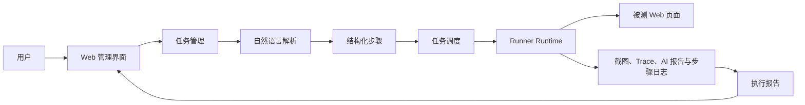
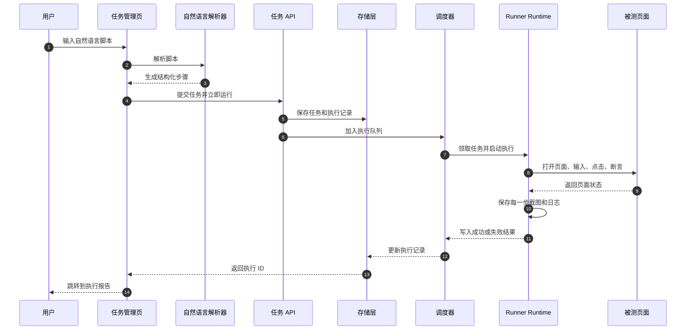
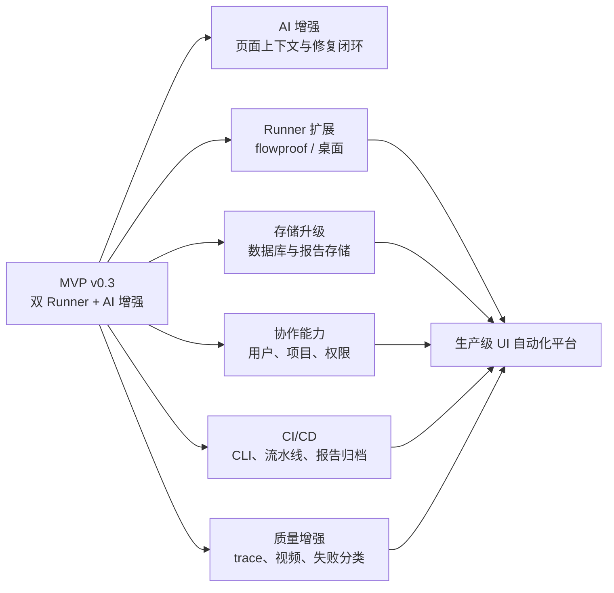

# UI 自动化平台 MVP 功能模块

> 版本：MVP v0.3
> 范围：单机 Web UI 自动化控制面
> 执行目标：Web 应用；确定性 Playwright Runner 和 Midscene AI Runner
> 当前定位：先跑通“AI 草稿 → 人工确认 → 执行 → 日志 → 截图 → 失败修复建议”的完整闭环
> 后续方向：flowproof、桌面 Runner、数据库、CI/CD 和更完整的报告体系

## 1. MVP 目标

当前 MVP 不追求覆盖所有自动化场景，而是先验证平台最小闭环：

1. 用户能创建、编辑、删除和运行 Web UI 自动化任务。
2. 用户能用常见中文自然语言描述操作，并生成可编辑的 Playwright 步骤。
3. 用户可以按任务选择 Playwright 或 Midscene 执行引擎。
4. 平台能按步骤执行任务，记录结果、执行器、耗时和尝试次数。
5. 每一步都保留页面截图，失败时也保留失败现场。
6. Playwright 任务可选保存 trace；Midscene 任务可归档 AI 报告。
7. 用户能通过执行监控页查看状态、进度、日志和截图。
8. 平台保留任务和执行历史，服务重启后能识别中断状态。
9. 用户能基于业务需求生成 AI 用例草稿，预览确认后再保存。
10. Playwright 定位器失败后，用户能生成并人工确认候选修复。

### 最小闭环



## 2. 功能模块总览

| 模块 | 当前状态 | 核心价值 | 主要入口 |
| :--- | :--- | :--- | :--- |
| 仪表盘 | 已实现 | 查看任务、通过率、失败、耗时和最近执行 | `/` |
| 任务管理 | 已实现 | 创建、编辑、运行、删除结构化任务 | `/tasks` |
| 自然语言转步骤 | 已实现 | 将常见中文指令转换为可编辑 Playwright 步骤 | `/tasks` |
| AI 用例生成 | 已实现 | 将开放业务需求转换为任务草稿，保存前必须人工确认 | `/tasks`、`POST /api/tasks/generate` |
| 执行调度 | 已实现 | 保存排队任务、更新状态并调用执行器 | `POST /api/tasks/:id/run` |
| Runner Runtime | 已实现 | 统一浏览器生命周期、截图、trace、取消和步骤日志 | `lib/runner-runtime.ts` |
| Playwright Runner | 已实现 | 驱动 Chromium / Firefox / WebKit 执行确定性步骤 | `lib/runners/playwright.ts` |
| Midscene Runner | 已实现 | 使用自然语言驱动定位、输入、点击和语义断言 | `lib/runners/midscene.ts` |
| 失败自愈建议 | 已实现 | 为 Playwright click/fill 定位器失败生成可见性验证过的候选 | `/executions`、`POST /api/executions/:id/heal` |
| 执行监控 | 已实现 | 查看执行状态、步骤进度、耗时和错误 | `/executions` |
| 截图与产物 | 已实现 | 保存截图、Playwright trace 和 Midscene HTML 报告 | `/api/executions/:id/artifacts/:name` |
| 数据持久化 | 已实现 | 保存任务、执行记录、日志和状态 | `data/platform.json` |
| 健康检查 | 已实现 | 提供服务可用性检查入口 | `/api/health` |
| 内置演示页 | 已实现 | 提供登录示例，用于快速验证平台能力 | `/demo/login.html` |

## 3. 平台架构

```mermaid
flowchart TB
    subgraph ui["管理界面"]
        dashboard["仪表盘"]
        tasks["任务管理"]
        aiForm["AI 用例生成"]
        executions["执行监控"]
    end

    subgraph api["API 服务"]
        taskApi["任务 API"]
        runApi["执行 API"]
        aiApi["AI 生成 API"]
        healingApi["自愈 API"]
        artifactApi["产物 API"]
        healthApi["健康检查"]
    end

    subgraph core["平台核心"]
        validation["参数校验"]
        parser["自然语言解析器"]
        generator["AI 用例生成器"]
        healing["失败自愈建议器"]
        store["文件存储层"]
        queue["任务调度器"]
    end

    subgraph runtime["执行层"]
        runtime["Runner Runtime"]
        playwright["Playwright Runner"]
        midscene["Midscene Runner"]
        browsers["Chromium / Firefox / WebKit"]
    end

    dashboard --> store
    tasks --> taskApi
    tasks --> aiForm
    executions --> runApi
    executions --> healingApi

    taskApi --> validation
    taskApi --> parser
    aiApi --> generator
    aiApi --> validation
    healingApi --> healing
    healing --> validation
    taskApi --> store
    runApi --> queue
    queue --> store
    queue --> runtime
    runtime --> playwright
    runtime --> midscene
    playwright --> browsers
    midscene --> browsers
    runtime --> artifacts["reports 目录"]
    artifacts --> artifactApi
    artifactApi --> executions
    store --> dashboard
    store --> executions
```

## 4. 模块说明

### 4.1 仪表盘

仪表盘是平台首屏，用服务端读取当前状态，展示自动化平台的基本运行情况。

**已包含能力**

- 任务总数统计。
- 已完成执行的通过率。
- 失败和中断数量。
- 平均执行耗时。
- 最近执行列表。
- 执行状态、步骤进度、耗时和详情入口。

**当前边界**

- 统计范围限于本地 JSON 文件中的历史记录。
- 没有跨项目、跨环境、跨团队的聚合分析。
- 没有长期趋势图和失败分类统计。

### 4.2 任务管理

任务管理模块负责维护自动化用例。当前任务模型以结构化步骤为中心，目标是让执行过程可复现、可编辑、可排查。

**已包含能力**

- 新建任务。
- 编辑任务名称、描述、标签、执行引擎、运行时配置、步骤和 headless 配置。
- 删除任务。
- 手动触发任务运行。
- 查看任务数量、目标平台和步骤数。
- 保留历史执行报告，即使任务被删除也不立即清空报告。

**任务字段**

| 字段 | 说明 |
| :--- | :--- |
| `id` | 任务唯一 ID |
| `name` | 任务名称 |
| `target` | 执行目标，当前为 `web` |
| `runner` | 执行引擎：`playwright` 或 `midscene`；旧数据缺省为 `playwright` |
| `runtime` | 浏览器、失败重试次数和 trace 开关 |
| `description` | 任务说明 |
| `labels` | 标签，用于后续筛选和分组 |
| `headless` | 是否无头执行浏览器 |
| `steps` | 自动化步骤列表 |
| `createdAt` / `updatedAt` | 创建和更新时间 |

**支持的步骤动作**

| 动作 | 用途 | 当前说明 |
| :--- | :--- | :--- |
| `goto` | 打开页面 | 相对地址会基于 `UI_PLATFORM_BASE_URL` 解析 |
| `click` | 点击元素 | 支持普通选择器和语义化字段定位 |
| `fill` | 输入内容 | 支持普通选择器和 `label=字段名` 语义定位 |
| `press` | 按键 | 常用于回车、Esc、Tab 等键盘动作 |
| `wait` | 等待 | 固定等待，适合 MVP 阶段的简单同步 |
| `expectText` | 文本断言 | 在指定元素或页面 body 中等待期望文本可见 |
| `aiAct` | AI 操作 | 仅 Midscene；用自然语言描述页面操作 |
| `aiAssert` | AI 断言 | 仅 Midscene；用自然语言描述业务结果 |
| `aiQuery` | AI 提取 | 仅 Midscene；按 JSON Schema 提取页面数据 |
| `aiWaitFor` | AI 等待 | 仅 Midscene；等待语义条件成立 |

### 4.3 自然语言转步骤

自然语言模块使用确定性规则解析常见中文指令，不依赖大模型，保证同一句法能稳定生成同一步骤。

**已包含能力**

- 按换行或常见分隔符拆分脚本。
- 识别打开页面、输入、点击、按键、等待和断言文本。
- 保留错误行号，便于用户修改脚本。
- 解析后进入可编辑任务表单，用户可以在执行前调整步骤。
- 可以选择把解析结果交给 Playwright 或 Midscene 执行。
- 支持常见登录字段写法，例如“账号输入 demo@example.com”“密码输入 secret”。
- 对“点击登录”或“点击提交”优先定位 submit 按钮，避免误命中页面标题。

**支持示例**

```text
打开 /demo/login.html
账号输入 demo@example.com
租户输入 tenant-1
密码输入 secret
点击登录按钮
断言页面包含"工作台"
```

**当前边界**

- 只支持规则内描述的指令，不是开放语义理解。
- 规则解析本身不调用大模型；选择 Midscene 后才在执行阶段调用模型。
- 复杂弹窗、表格、拖拽、上传、下载、iframe 和多标签页还需要扩展。

### 4.4 AI 用例生成与失败自愈

AI 增强能力复用 Midscene 的 OpenAI-compatible 模型配置。生成和自愈都只产出候选数据，平台不会把模型结果直接交给执行队列或直接写回任务。

**AI 用例生成**

- 用户输入业务需求、目标 URL 和执行引擎，先生成任务草稿。
- Playwright 草稿只允许确定性动作；Midscene 草稿允许平台白名单内的 AI 动作。
- 第一步强制为 `goto`；生成结果仍通过 `parseTaskDraft()` 白名单校验。
- 默认只返回预览，用户点击保存后才创建任务，平台不会自动执行。

**失败自愈建议**

- 只处理 Playwright Runner 的 `click` / `fill` 失败，且失败日志必须包含原定位器。
- 服务端把原动作、原定位器、输入值、错误信息和失败截图发给模型。
- 候选 target 只接受 `page.locator()` 兼容写法或平台 `label=字段名` 扩展。
- 保存建议前会重放失败前步骤，并验证候选元素真实可见。
- 建议状态为 `proposed`、`applied`、`rejected`；当前界面支持生成和应用，应用即代表用户确认。
- 应用时只替换与失败现场一致的 target，不改变动作和输入值，也不覆盖应用前的手工修改。

**当前边界**

- AI 语义步骤、`expectText`、`press` 和 `wait` 不自愈。
- 自愈建议不会自动应用，也不会自动重跑任务。
- 模型输出的置信度只作展示参考，不作为自动应用条件。

### 4.5 执行调度

调度模块接收运行请求，创建执行记录，并把任务交给执行器。当前实现为单机进程内调度，先把 MVP 闭环跑通。

**已包含能力**

- 为一次运行生成执行 ID。
- 初始化 `queued` 状态。
- 记录入队时间和总步骤数。
- 按顺序调度执行。
- 根据 `runner` 和 `runtime.browser` 调用对应执行器。
- 支持 0-3 次额外重试，并把实际尝试次数写入执行报告。
- 更新运行状态和最终结果。
- 任务被删除后，对应执行记录会标记失败原因。

**执行状态**

| 状态 | 说明 |
| :--- | :--- |
| `queued` | 已创建，等待执行 |
| `running` | 正在执行 |
| `succeeded` | 全部步骤通过 |
| `failed` | 步骤失败或执行异常 |
| `interrupted` | 服务重启导致执行中断 |

### 4.6 执行层与 Runner

执行层拆成三层：`lib/executor.ts` 是队列依赖的稳定门面；`lib/runner-runtime.ts` 管浏览器、trace、截图、取消和日志；`lib/runners/*` 只负责单步执行语义。

**Runner Runtime 已包含能力**

- 启动 Chromium、Firefox 或 WebKit。
- 根据任务配置选择 headless 或有头模式。
- 创建独立浏览器上下文。
- 记录每一步的开始时间、耗时、状态和截图。
- 成功和失败都保存页面截图。
- 可选保存 Playwright trace。
- 执行结束后关闭浏览器。

**Playwright Runner 已包含能力**

- 逐步执行 `goto`、`click`、`fill`、`press`、`wait`、`expectText`。
- 对 `label=字段名` 做语义化定位兜底。
- 适合选择器稳定、执行成本低、不能依赖大模型的核心链路。

**Midscene Runner 已包含能力**

- 使用 `PlaywrightAgent` 驱动同一个浏览器上下文。
- 支持语义点击、输入、按键和文本断言。
- 支持 `aiAct`、`aiAssert`、`aiQuery`、`aiWaitFor`。
- 归档 Midscene 单页 HTML 报告到执行产物目录。
- 缺少模型配置时立即失败，并提示缺少的环境变量。

**语义化定位规则**

当步骤目标使用 `label=账号` 这类写法时，执行器会依次尝试：

1. `getByLabel` 查找控件。
2. `getByPlaceholder` 查找输入框。
3. `aria-label`、`name` 等属性兜底查找。

这样可以减少中文页面里因 label 结构不规范导致的用例失败。

### 4.7 执行监控与报告

执行监控模块负责展示一次任务运行的完整过程。

**已包含能力**

- 查看执行列表。
- 按执行 ID 聚焦指定报告。
- 查看当前状态。
- 查看步骤进度，例如 `3/6`。
- 查看总耗时。
- 查看每一步的动作、状态、耗时和错误信息。
- 查看每一步使用的执行器、执行方式和 Playwright 定位器。
- 查看 AI 断言或提取的结构化结果。
- 查看步骤截图。
- 查看 Midscene HTML 报告和下载 Playwright trace。
- 查看 Playwright click/fill 失败修复建议、置信度、原因和应用状态。
- 从报告页返回任务列表。

**报告记录字段**

| 字段 | 说明 |
| :--- | :--- |
| `id` | 执行唯一 ID |
| `taskId` | 关联任务 ID |
| `status` | 执行状态 |
| `queuedAt` | 入队时间 |
| `startedAt` | 开始时间 |
| `finishedAt` | 结束时间 |
| `durationMs` | 总耗时 |
| `runner` | 执行引擎 |
| `browser` | 浏览器内核 |
| `attempts` | 实际尝试次数 |
| `currentStep` | 当前步骤 |
| `totalSteps` | 总步骤数 |
| `logs` | 每一步的执行日志 |
| `healing` | 人工确认式定位器修复建议列表 |
| `reportUrl` | Midscene HTML 报告 |
| `tracePath` | Playwright trace 压缩包 |
| `error` | 失败或中断原因 |

### 4.8 截图与产物

执行器会在每一步完成后保存截图。如果某一步失败，还会额外保存失败现场截图。

**产物规则**

| 产物 | 说明 |
| :--- | :--- |
| `step-01.png` | 第 1 步成功后的页面截图 |
| `step-02.png` | 第 2 步成功后的页面截图 |
| `step-03-failed.png` | 第 3 步失败现场截图 |
| `trace.zip` | Playwright trace，需下载后用 Playwright Trace Viewer 打开 |
| `midscene-report.html` | Midscene AI 执行过程报告 |

截图保存在 `reports/<executionId>/` 目录下，通过执行详情页或 artifact API 访问。

### 4.9 数据持久化

MVP 使用 JSON 文件保存任务和执行记录，减少数据库依赖，便于本地验证。

**已包含能力**

- 保存任务列表和执行历史。
- 任务 CRUD。
- 执行记录创建和状态更新。
- 原子写入，降低写文件过程中断的风险。
- 单进程内串行化写操作，避免多个 API 请求互相覆盖。
- 服务重启后把无法继续的 `queued` / `running` 执行标记为 `interrupted`。

**当前边界**

- JSON 文件适合单机验证，不适合多实例生产部署。
- 缺少数据库索引、权限控制、数据备份和跨实例锁。
- 报告文件和状态文件目前分别落盘，后续需要统一生命周期管理。

### 4.10 API 模块

当前 API 已经能支撑管理界面完成主要操作。

| API | 方法 | 作用 |
| :--- | :--- | :--- |
| `/api/tasks` | `GET` | 查询任务列表 |
| `/api/tasks` | `POST` | 创建结构化任务 |
| `/api/tasks/:id` | `GET` | 查询任务详情 |
| `/api/tasks/:id` | `PUT` | 更新任务 |
| `/api/tasks/:id` | `DELETE` | 删除任务 |
| `/api/tasks/:id/run` | `POST` | 运行任务 |
| `/api/tasks/from-script` | `POST` | 解析自然语言脚本并创建执行 |
| `/api/tasks/generate` | `POST` | 生成 AI 任务草稿；`save=true` 时才保存 |
| `/api/executions/:id/heal` | `POST` | 为可修复失败生成候选定位器 |
| `/api/tasks/:id/apply-healing` | `POST` | 人工确认应用一条修复建议 |
| `/api/executions` | `GET` | 查询执行列表 |
| `/api/executions/:id` | `GET` | 查询执行详情 |
| `/api/executions/:id/artifacts/:name` | `GET` | 读取截图产物 |
| `/api/health` | `GET` | 健康检查 |

### 4.11 页面模块

| 页面 | 路由 | 主要功能 |
| :--- | :--- | :--- |
| 仪表盘 | `/` | 展示平台统计、队列状态和最近执行 |
| 任务管理 | `/tasks` | 创建、编辑、运行和删除任务；提供规则脚本和 AI 草稿入口 |
| 执行监控 | `/executions` | 查看执行列表、报告详情和失败修复建议 |

## 5. 端到端执行链路



## 6. MVP 范围内外

### 6.1 当前包含

- Web / Chromium 自动化执行。
- Web / Firefox / WebKit 确定性执行。
- Midscene AI 语义执行和 AI 报告。
- 结构化任务管理。
- 常见中文自然语言规则解析。
- AI 需求草稿生成与人工确认保存。
- Playwright click/fill 失败候选定位器建议。
- 单机任务调度。
- 步骤级日志。
- 成功和失败截图。
- 可选 Playwright trace。
- JSON 文件持久化。
- 基础仪表盘。
- 执行详情页。
- 内置登录演示场景。

### 6.2 暂不包含

| 能力 | 当前状态 | 后续方向 |
| :--- | :--- | :--- |
| 桌面自动化 | 未接入 | 增加 Windows / macOS / Linux Runner |
| AI 生成页面上下文增强 | 未接入 | 当前依赖需求描述和首步 URL，后续可采集 DOM 摘要或页面截图 |
| 自愈批量应用与忽略 | 未接入 | 当前逐条应用；可补充 rejected 管理和批量确认 |
| 自愈历史学习 | 未接入 | 记录失败类、变更来源和修复成功率 |
| flowproof 确定性回放 | 未接入 | 将稳定用例转为零 LLM 回放 |
| BullMQ / Redis | 未接入 | 多进程或多机部署时替换进程内调度 |
| 数据库 | 未接入 | 多用户生产部署时替换 JSON 存储 |
| 用户和权限 | 未实现 | 增加登录、角色、项目和执行权限 |
| CI/CD | 未实现 | 提供 CLI 和流水线报告归档 |
| 定时任务 | 未实现 | 增加计划任务和触发器 |
| 视频 | 未实现 | 补充失败现场回放证据 |
| 多环境管理 | 未实现 | 增加环境变量、账号和目标环境配置 |
| 开放 API Token | 未实现 | 支持外部系统安全调用 |

## 7. 配置项

| 配置 | 说明 | 默认值 |
| :--- | :--- | :--- |
| `UI_PLATFORM_BASE_URL` | 相对 URL 的解析基准 | `http://127.0.0.1:3000` |
| `UI_PLATFORM_MAX_CONCURRENCY` | 单机调度上限，取值 1-10 | `5` |
| `UI_PLATFORM_AI_STEP_TIMEOUT` | 单个 Midscene 步骤硬超时 | `60000` |
| `UI_PLATFORM_GENERATOR_MODEL` | AI 生成/自愈可选模型覆盖 | 复用 `MIDSCENE_MODEL_NAME` |
| `UI_PLATFORM_AI_REQUEST_TIMEOUT` | AI 生成/自愈 HTTP 请求超时 | `120000` |
| `MIDSCENE_MODEL_BASE_URL` | Midscene 模型服务地址 | 无 |
| `MIDSCENE_MODEL_API_KEY` | Midscene 模型 API Key | 无 |
| `MIDSCENE_MODEL_NAME` | Midscene 模型名称 | 无 |
| `MIDSCENE_MODEL_FAMILY` | Midscene 模型族，按所选模型配置 | 无 |

> 说明：MVP 阶段关注执行闭环，该配置只作为本地资源保护；多机调度不在本轮产品目标内。

## 8. MVP 验收场景

| 场景 | 操作 | 预期结果 |
| :--- | :--- | :--- |
| 创建结构化任务 | 在任务管理页新建包含 `goto`、`fill`、`click`、`expectText` 的任务 | 任务保存成功，列表显示正确步骤数 |
| 自然语言生成用例 | 输入打开页面、输入字段、点击按钮、断言文本 | 系统生成可编辑 Playwright 步骤 |
| AI 用例生成保护 | 未配置模型环境变量时请求生成 | 返回 400 并列出缺失变量 |
| AI 草稿确认 | 输入业务需求后生成并保存 | 先展示步骤预览；保存成功后不自动执行 |
| Playwright 自愈 | 用错误 click 定位器执行并生成建议 | 候选在失败前步骤重放后验证可见 |
| 自愈人工确认 | 应用候选并重跑 | 只有确认后 target 才被替换，重跑使用新定位器 |
| 自愈并发保护 | 生成建议后手工修改原 target 再应用 | 返回错误并要求重新生成建议 |
| 执行登录示例 | 运行内置登录任务 | 状态变为 `succeeded`，每一步有截图 |
| Playwright trace | 开启 trace 后执行失败任务 | 报告页出现 `trace.zip` 下载入口 |
| Midscene 配置保护 | 未配置模型环境变量时运行 AI 任务 | 执行立即失败并列出缺失变量 |
| Midscene AI 步骤 | 创建 `aiAct`、`aiAssert` 或 `aiQuery` 步骤 | 只有 `runner=midscene` 能保存和执行 |
| 查看执行报告 | 进入执行详情 | 能看到状态、步骤进度、耗时、日志和截图 |
| 失败现场保留 | 执行一个断言失败任务 | 状态变为 `failed`，失败步骤保留截图和错误信息 |
| 编辑后重跑 | 修改任务步骤后再次运行 | 生成新的执行记录，旧报告保留 |
| 删除任务 | 删除任务后查看历史执行 | 历史报告仍可访问 |
| 健康检查 | 请求 `/api/health` | 返回服务可用状态 |

## 9. MVP 完成标准

1. 用户可以从自然语言或结构化表单创建任务。
2. 用户可以预览并确认保存 AI 生成草稿。
2. Web 任务能稳定执行内置登录示例。
3. 执行过程中的每一步都有日志和截图。
4. 用户能选择 Playwright 或 Midscene Runner。
5. 失败任务能明确展示失败步骤、错误信息和页面截图。
6. trace 和 Midscene 报告能通过 artifact API 获取。
7. 任务和执行历史在服务重启后不丢失。
8. 服务异常重启后，历史 `queued` / `running` 记录能被标记为 `interrupted`。
9. 失败 Playwright 任务能生成、验证并人工应用 click/fill 定位器修复。
10. 管理界面、任务 API、执行 API 和 artifact API 能支撑完整闭环。

## 10. 从 MVP 到生产平台的下一步



优先建议：

1. **先深化 AI 增强**：补充页面上下文采集、修复忽略、批量确认和修复成功率统计。
2. **再替换存储**：将 JSON 文件升级为数据库，支持多用户、多 attempt 历史和长期报告。
3. **再扩展 Runner**：保留当前任务和报告模型，接入 flowproof 和桌面执行器。
4. **最后接入 CI/CD**：提供 CLI、API Token 和流水线报告归档，把平台纳入发布流程。
