# UI 自动化测试框架调研对比：增强版

> 调研时间：2026 年 10 月\
> 目标场景：Web + 桌面应用\
> 本轮边界：先验证单任务执行链路，暂不设计并发扩容方案\
> 部署约束：开源自建，数据不出内网\
> 结论时效：框架版本和商业平台能力仍在演进，正式立项前应以 POC 复测为准

## 0. 执行摘要

本次调研的推荐不是单一框架，而是一套分层组合：

1. **主执行引擎选择 Midscene.js**：平台覆盖、自然语言能力、CI/CD 成熟度和社区活跃度综合最优。
2. **稳定回归引入 flowproof**：录制后确定性回放，运行时零 LLM 调用，用来压制成本和抖动。
3. **低模型成本场景备选 PageEyes-Agent**：OmniParser + 小参数 LLM 的路线对模型要求更低，但 CI 和桌面能力仍需 POC 验证。
4. **调度层使用 BullMQ + Redis**：提供队列、重试、优先级和状态管理。
5. **管理面使用 Next.js**：承载任务管理、执行监控、实时画布和报告查看。

| 结论 | 推荐 | 主要理由 |
| :--- | :--- | :--- |
| 首选 | **Midscene.js + BullMQ + Next.js** | 双平台覆盖最均衡，私有化落地阻力小 |
| 回归补充 | **flowproof** | 稳定用例零 AI 调用，CI 可复现性最好 |
| 成本备选 | **PageEyes-Agent** | 降低 VLM 依赖，适合模型成本敏感场景 |
| 专项参考 | **Autonoma / Karate Agent** | 分别适合 Web 代码库生成测试与 API+Web 组合 |
| 不推荐作主方案 | **Selenium / Cypress 原生选择器路线** | 选择器脆弱，维护成本与本轮目标冲突 |

### 选型决策总览

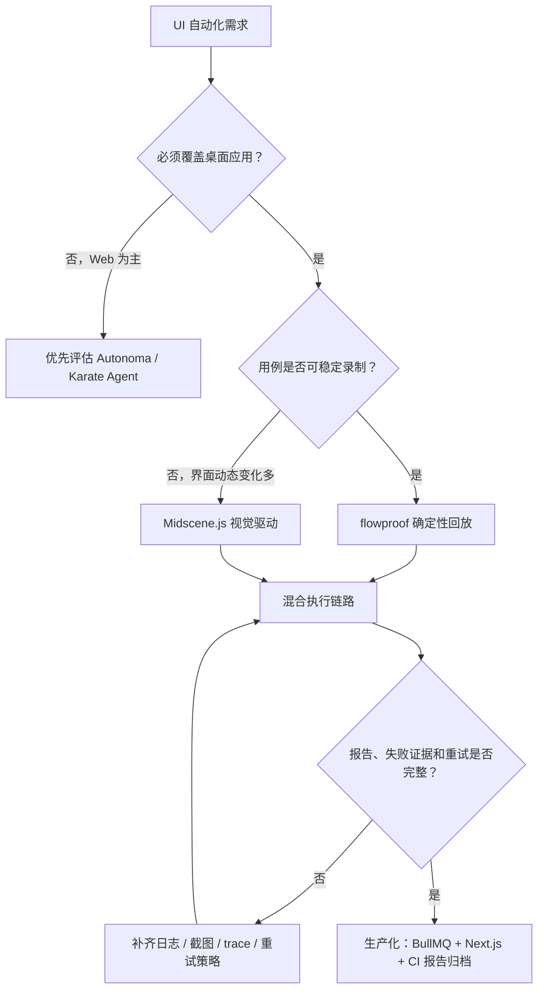

## 1. 需求地图与评价原则

本轮评价不把“是否支持自然语言”作为唯一标准，而是同时检查执行确定性、失败定位效率和私有化成本。一个只有演示价值的 Agent 方案，不应因为能理解自然语言就被优先采用。

### 需求地图

```mermaid
flowchart TD
    root["Web + 桌面 UI 自动化"] --> assets["测试资产"]
    root --> platforms["平台覆盖"]
    root --> engineering["工程化"]
    root --> reliability["可靠性"]
    root --> governance["成本与治理"]

    assets --> a1["自然语言编写"]
    assets --> a2["业务人员可读"]
    assets --> a3["用例可版本化"]

    platforms --> p1["Web 浏览器"]
    platforms --> p2["Windows 桌面"]
    platforms --> p3["macOS 辅助功能"]
    platforms --> p4["Linux Xvfb"]
    platforms --> p5["移动端扩展"]

    engineering --> e1["GitLab / Jenkins"]
    engineering --> e2["无头执行"]
    engineering --> e3["重试与隔离"]
    engineering --> e4["报告归档"]

    reliability --> r1["失败截图"]
    reliability --> r2["trace 回放"]
    reliability --> r3["独立会话上下文"]

    governance --> g1["开源自建"]
    governance --> g2["模型调用可控"]
    governance --> g3["权限安全"]
    governance --> g4["长期维护"]
```

### 评价权重

| 维度 | 权重 | 判断重点 |
| :--- | ---: | :--- |
| 平台支持 | 25% | Web 与 Windows/macOS/Linux 桌面覆盖是否可落地 |
| 自然语言能力 | 15% | 步骤、断言和失败解释是否完整 |
| CI/CD 集成 | 20% | CLI、无头模式、报告产物和退出码 |
| 可持续性 | 20% | UI 变更后的维护成本与自愈能力 |
| 自建友好度 | 10% | 私有化部署、依赖复杂度和数据边界 |
| 成熟度 | 10% | 文档、社区、版本稳定性和生产风险 |

## 2. 框架能力压缩对比

| 框架 | 类型 | 平台支持 | 驱动方式 | 自然语言 | 执行确定性 | 自建难度 | 许可证 |
| :--- | :--- | :--- | :--- | :--- | :--- | :--- | :--- |
| **Midscene.js** | 开源 | Web、桌面、移动 | 视觉驱动 VLM | 完整 | 中，受模型影响 | 中 | MIT |
| **PageEyes-Agent** | 开源 | Web、Android/iOS、Electron | OmniParser + LLM | 完整 | 中，待验证 | 中 | MIT |
| **flowproof** | 开源 | Web、Windows 桌面、SAP、Citrix | 录制-确定性回放 | 编写阶段 | 高 | 低 | 开源 alpha |
| **Autonoma** | 开源/源码可用 | Web | AI Agent | 完整 | 待验证 | 较高 | 源码可用 |
| **Talos** | 开源 | Web、Mobile | LLM Vision | 支持 | 待验证 | 中 | 开源 |
| **Karate Agent** | 开源 | Web、API | AI 语义定位 | 支持 | 中，待验证 | 中 | Apache 2.0 |

### 加权适配度

以下分数是把定性能力映射到 1-5 分后加权计算的结果，用于横向比较，不能替代真实 POC 指标。

| 框架 | 平台 | 自然语言 | CI/CD | 可持续性 | 自建 | 成熟度 | **加权得分** |
| :--- | ---: | ---: | ---: | ---: | ---: | ---: | ---: |
| **Midscene.js** | 5 | 5 | 4 | 4 | 4 | 4 | **4.40** |
| **flowproof** | 3 | 4 | 4 | 5 | 5 | 2 | **3.85** |
| **PageEyes-Agent** | 4 | 5 | 2 | 4 | 4 | 3 | **3.65** |
| **Autonoma** | 2 | 5 | 3 | 4 | 3 | 3 | **3.25** |
| **Karate Agent** | 2 | 4 | 3 | 3 | 4 | 4 | **3.10** |
| **Talos** | 3 | 4 | 2 | 3 | 3 | 3 | **2.95** |

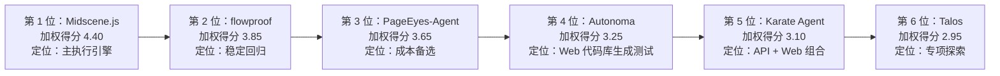

### 技术分组

下图把候选方案按用途分组，避免只看总分后把不同定位的框架放在同一执行角色里比较。

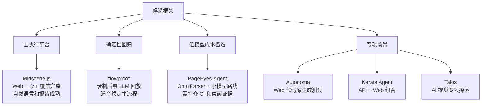

## 3. 重点框架评估

### 3.1 Midscene.js：推荐主引擎

Midscene.js 通过截图和多模态模型理解界面，用自然语言完成定位、操作和断言。它提供 JavaScript SDK、YAML 脚本、Playwright/Puppeteer 集成和可视化报告，适合作为平台的默认执行引擎。

**优势**

- 覆盖 Web、Windows、macOS、Linux、Android、iOS、HarmonyOS 和可截图界面。
- 桌面端驱动原生键盘和鼠标，Linux CI 可通过 Xvfb 实现无头运行。
- `midscene.config.ts` 可配置超时和失败阈值，CLI 便于接入 GitLab CI 或 Jenkins。
- 视觉定位降低 XPath/CSS 选择器失效带来的维护成本。

**限制**

- 重复执行的 AI 用例会放大模型耗时和费用，必须做调用预算和缓存治理。
- 桌面自动化依赖系统权限，Windows 提权程序和 macOS 辅助功能需要提前处理。
- AI 定位仍需要截图、日志和报告支撑，否则失败原因难以复盘。

### 3.2 flowproof：稳定回归与成本阀门

flowproof 采用“自然语言描述 + 一次录制 + 确定性回放”的模式，CI 运行时不调用 LLM。它不适合承担所有探索性验证，但非常适合承载登录、导航、报表打开、桌面主流程等稳定回归。

**优势**

- 运行结果可复现，减少模型波动导致的 CI 假失败。
- 回放链路更轻，适合先承载稳定主流程。
- Windows 桌面、SAP 和 Citrix 场景有差异化价值。

**限制**

- 仍处于 alpha 阶段，生产化风险需要通过非关键用例逐步验证。
- UI 频繁变化时录制资产需要重建。
- 当前桌面能力以 Windows 为主，macOS/Linux 不能按全平台假设处理。

### 3.3 PageEyes-Agent：低模型成本备选

PageEyes-Agent 基于 Pydantic AI 和 OmniParserV2，把元素感知与路径规划分离，因此不强制依赖大型 VLM，有机会使用更小、更便宜的模型完成执行。

**优势**

- 自然语言指令驱动完整，日志和报告较细。
- 对模型规格要求更低，长期调用成本可能更优。
- Electron 桌面场景具备一定吸引力。

**限制**

- 官方资料未明确 CI/CD 集成方式和生产级调度方案。
- 平台覆盖仍需按目标应用逐项验证。
- 若作为主方案，需要先补齐队列、重试、报告归档和权限治理。

### 3.4 其他候选

| 框架 | 适合条件 | 不建议作为首选的原因 |
| :--- | :--- | :--- |
| **Autonoma** | Web 为主，代码库规范，期望从源码自动生成 E2E 测试 | 桌面支持不明确，自建与代码库集成复杂度较高 |
| **Talos** | Web/Mobile 的 AI 视觉实验或专项探索 | CI 和工程化证据不足 |
| **Karate Agent** | API + Web 组合测试，团队已有 Karate 资产 | 桌面覆盖弱，调度能力依赖自建 |

## 4. 商业平台参考

商业平台不满足“开源自建”硬约束，但它们验证了几个架构方向：托管资源池、失败自动归因和低代码维护。自建平台应吸收这些产品能力，而不是简单复刻一个执行器。

| 平台 | 平台支持 | 自然语言 | CI/CD | 自愈能力 | 定价参考 |
| :--- | :--- | :--- | :--- | :--- | :--- |
| **TestRigor** | Web、Mobile、Desktop、API | 纯英文 | CLI + CI/CD | 选择器无关 | Public $900/月起 |
| **Mabl** | Web、Mobile、API | 低代码 | CLI + CI/CD | 强 | 询价 |
| **Functionize** | Web、Mobile、API | 自然语言 | CI/CD | AI 自愈 | 企业年约 $30,000 起 |
| **Harness AI** | Web | 自然语言 | 原生 CI/CD | 每次运行自愈 | 询价 |
| **Reflect** | Web | 无代码 | CI/CD | 独立算法 | Team $300/月 |

注意：Functionize 不支持桌面应用测试，范围以 Web、移动端和 API 为主，不能替代本轮的桌面需求。

## 5. 推荐平台架构

### 分层架构

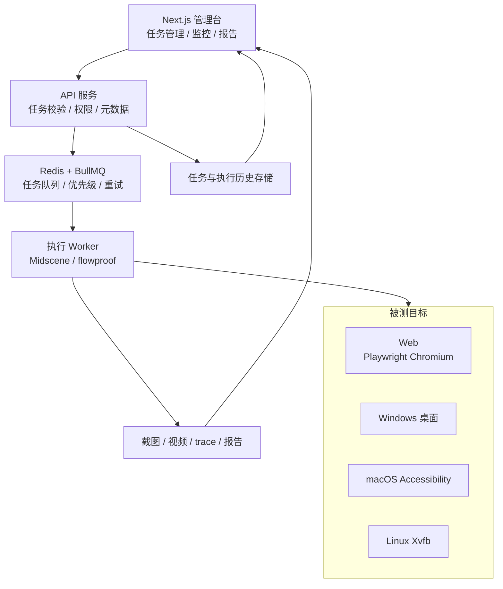

### 运行时序

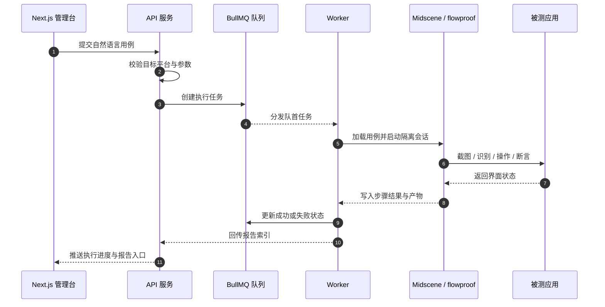

### 执行生命周期

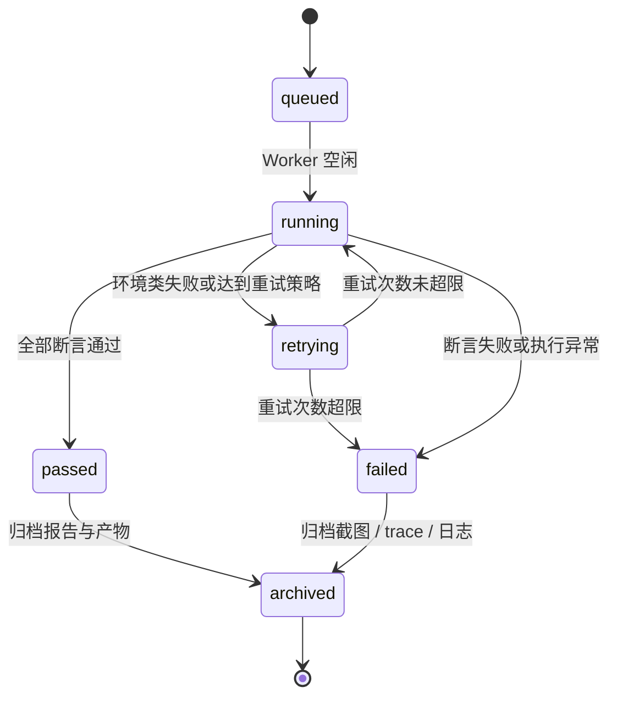

## 6. 失败与成本治理

### 任务路由与失败治理

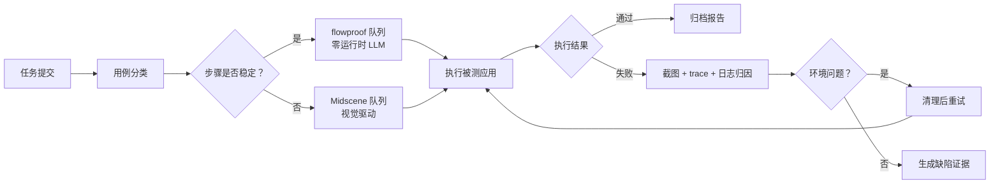

### 初始负载策略

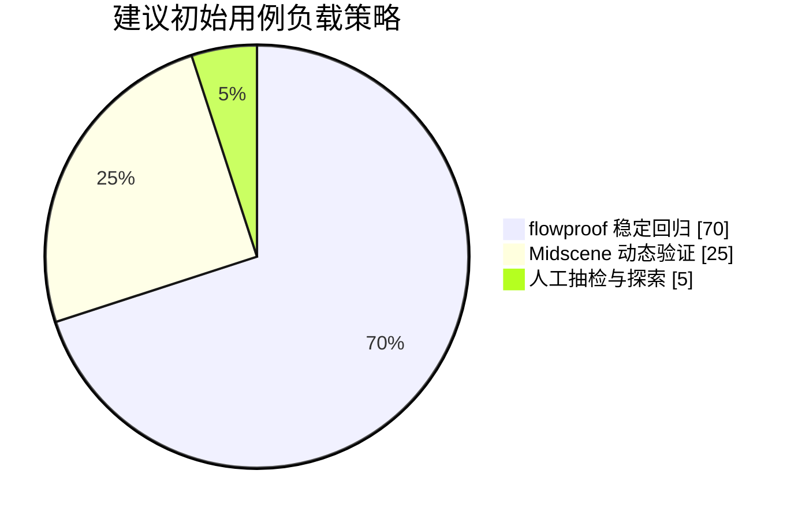

### 成本控制路径

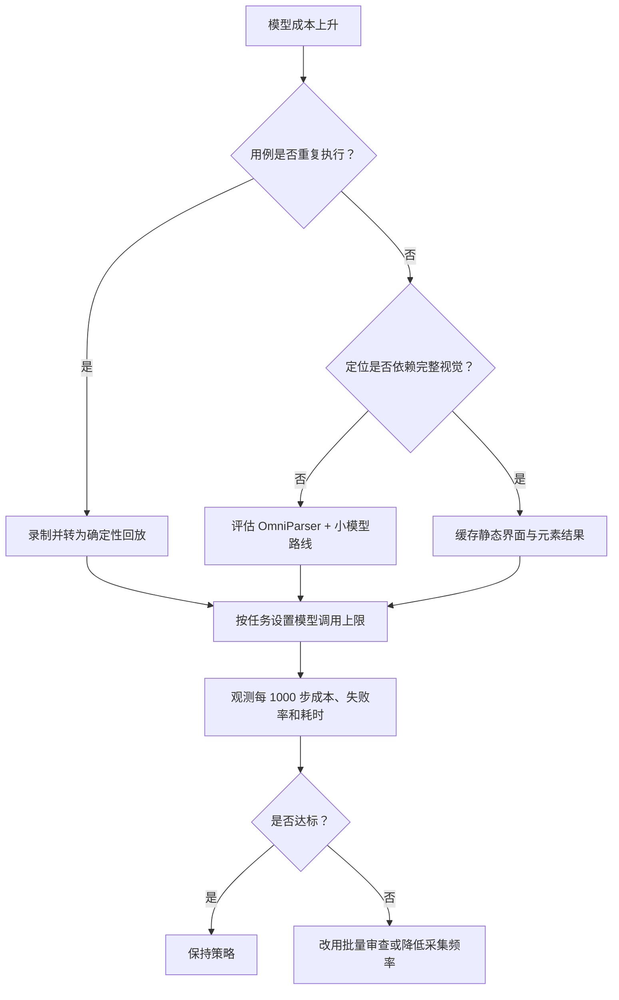

## 7. 实施计划

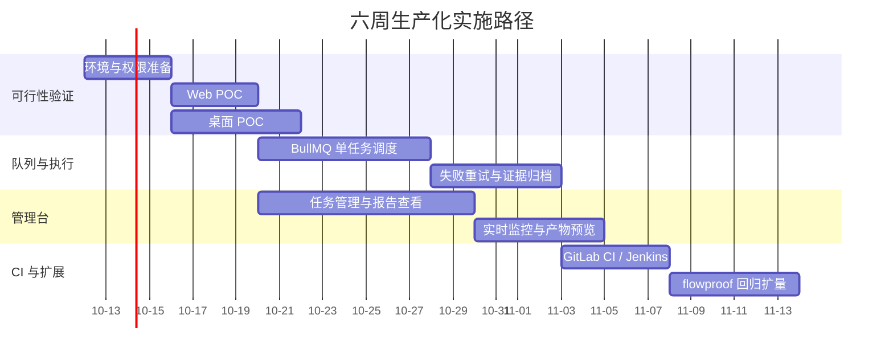

| 阶段 | 目标 | 退出标准 |
| :--- | :--- | :--- |
| 1. 验证 | 完成 Midscene Web 与桌面 POC | 关键用例可执行，报告包含截图、步骤和失败原因 |
| 2. 队列化 | BullMQ 单任务调度稳定运行 | 连续 20 次提交无误吞任务，失败可重试 |
| 3. 可视化 | 管理台可用 | 可查看任务、实时状态、报告、截图和视频 |
| 4. CI/CD | 流水线打通 | GitLab/Jenkins 退出码正确，报告产物可归档 |
| 5. 固化 | 固化用例资产与报告规范 | 核心用例可维护，报告可追溯到失败原因 |

### 验收指标

| 指标 | 目标 |
| :--- | :--- |
| 计划用例自动化率 | 首批覆盖核心主流程的 70% 以上 |
| CI 稳定性 | 稳定用例误报率低于 5% |
| 定位成功率 | Midscene 首次定位成功率不低于 90% |
| 修复效率 | UI 变更后平均修复时间不超过 30 分钟 |
| 模型成本 | 每千步成本可归因、可预算、可告警 |
| 证据完整度 | 失败必含截图、步骤日志和可回放 trace |

## 8. 风险分级与应对

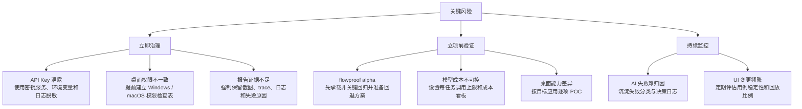

| 风险 | 影响 | 应对措施 |
| :--- | :--- | :--- |
| Windows 权限不一致 | 桌面点击被静默丢弃或拒绝 | 目标程序与执行进程权限对齐；提权场景单独建 Runner |
| macOS 辅助功能未授权 | 首次桌面自动化失败 | 在系统设置中为 Terminal/IDE/Runner 开启辅助功能 |
| flowproof alpha | 生产稳定性不确定 | 先承载非关键回归，设置灰度比例和回退方案 |
| 模型调用成本高 | AI 用例费用不可控 | 稳定用例回放化，动态用例设预算、缓存和批量审查 |
| AI 失败难归因 | 团队不信任测试结果 | 每次失败保留截图、trace、模型决策日志和 DOM/桌面上下文 |
| API Key 泄露 | 安全与费用风险 | 使用环境变量和密钥管理服务，禁止写入仓库或流水线日志 |

## 9. 前置准备清单

- [ ] 安装 Node.js >= 20.9.0 LTS。
- [ ] 安装 Redis >= 6.0，并为 BullMQ 配置持久化和告警。
- [ ] 安装 Playwright 与 Chromium。
- [ ] Linux CI 安装 Xvfb 与 ImageMagick。
- [ ] 安装 flowproof：`pip install flowproof`。
- [ ] 配置 LLM API Key，并按环境隔离读写权限。
- [ ] Windows 核对被测程序与 Runner 的权限级别。
- [ ] macOS 为 Runner、Terminal 或 IDE 开启辅助功能权限。
- [ ] 建立报告目录、产物保留策略和敏感信息脱敏规则。
- [ ] 选择首批 20-30 条主流程用例，覆盖 Web 和桌面关键路径。

## 10. 最终结论

**推荐采用“Midscene.js + flowproof + BullMQ + Next.js”的组合。**

Midscene.js 解决 Web 与桌面双平台的自然语言执行问题；flowproof 把重复且稳定的回归用例转成零 LLM 调用的确定性回放；BullMQ 提供任务队列、重试和状态管理；Next.js 负责让执行过程、失败证据和报告可被团队消费。这个组合先保证单任务链路可验证、可归因、可持续维护；后续是否扩容，应在主链路稳定后另行评估。
